# RuyiSDK 安装与使用文档
## 一．RuyiSDK 包管理器
安装：安装在 RISC-V 环境中。先用 uname -m 确认架构，随后从 ISCAS 镜像下载对应的 RuyiSDK 预编译二进制，赋予执行权限，安装到系统路径/usr/local/bin/ruyi ，并用 ruyi version/ruyi --help 验证。

使用：包管理常用操作包括刷新索引、查看新闻、搜索包、安装二进制包，安装源码包。

集成虚拟环境：先查看预置配置，再创建虚拟环境，激活这个虚拟环境后获取示例源码并用系统构建工具（如 make）编译，完成后退出环境即可。
### 1.1 使用预编译的二进制安装（ISCAS 镜像源）
（1）运行 uname -m 检查系统架构
```bash
uname -m
```
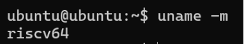

（2）下载适用于 RISC-V 的 RuyiSDK 二进制
```bash
wget https://mirror.iscas.ac.cn/ruyisdk/ruyi/tags/0.39.0/ruyi-0.39.0.riscv64 -O ruyi
```
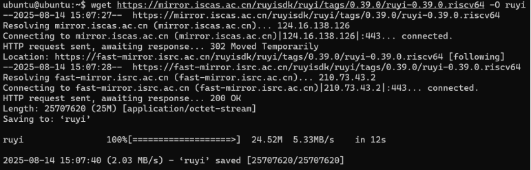

（3）赋予执行权限
```bash
chmod +x ./ruyi
```

（4）安装到系统路径
```bash
sudo cp -v ruyi /usr/local/bin/ruyi
```

（5）验证是否安装成功
```bash
ruyi version
```
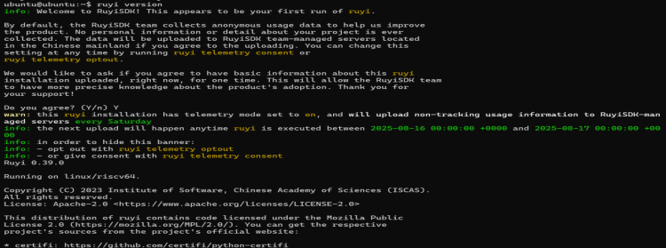

（6）列出帮助信息
```bash
ruyi --help
```
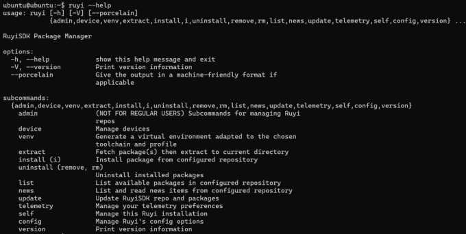

### 1.2 管理 Ruyi 软件包
（1）刷新本地软件包缓存
```bash
ruyi update
```
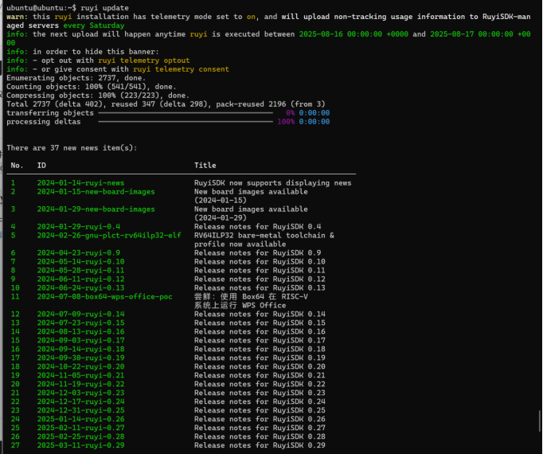

（2）阅读新闻
```bash
ruyi news list --new          # 看有哪些新新闻
ruyi news read                # 阅读全部未读新闻
```
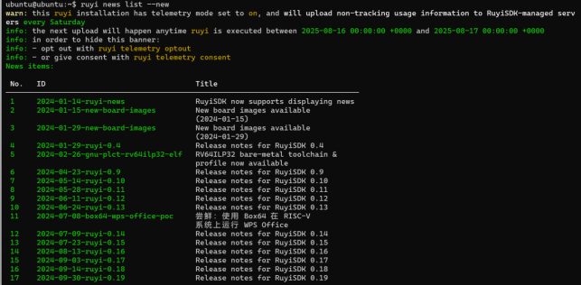
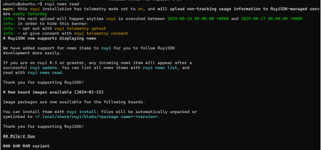

（3）列出软件包
列出所有包含指定名称关键词的包
```bash
ruyi list --name-contains <关键词>
```
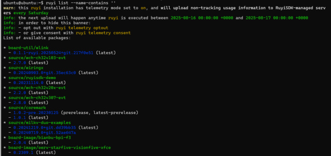

（4）安装二进制软件包
这些软件包可以使用 install 命令安装，如安装 GNU 上游 gcc 工具链：
```bash
ruyi install gnu-upstream
ruyi install toolchain/gnu-upstream
```
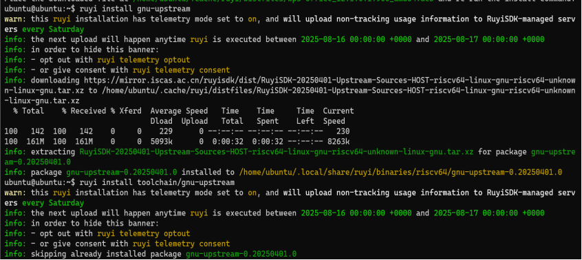

（5）安装源码包
源码包可以使用 extract 命令下载一个源码包并解包到当前目录：
```bash
ruyi extract ruyisdk-demo
```
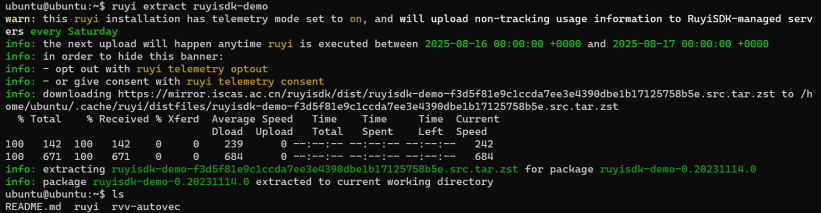

### 1.3 使用集成功能
（1）虚拟环境配置
Ruyi 软件源中已经提供了一些预置的配置且无需安装，这些配置可以使用如下命令列出：
```bash
ruyi list profiles
```
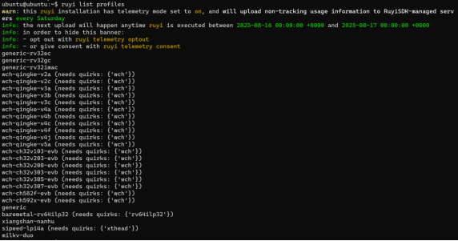

（2）虚拟环境集成
首先安装本示例所需的软件包：
```bash
ruyi install gnu-upstream
```

建立虚拟环境：
```bash
ruyi venv -t gnu-upstream generic ./riscv64-venv
```
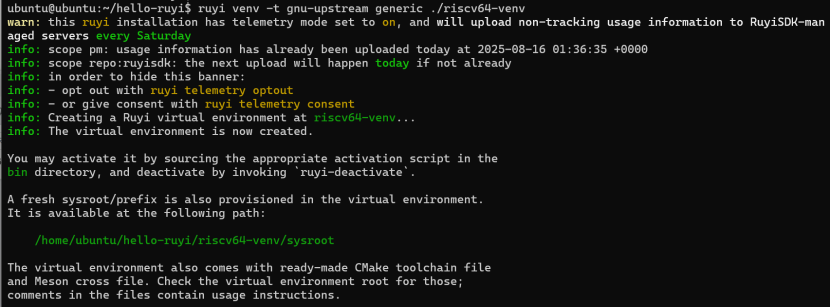

在虚拟环境目录可以看到编译环境相关的文件：
```bash
ls ./riscv64-venv/
```
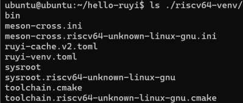

在 bin 目录下可以查看到可用的工具链二进制：
```bash
ls ./riscv64-venv/bin/
```
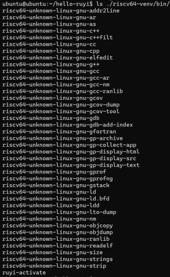

获取 ruyisdk-demo 源码：
```bash
ruyi extract ruyisdk-demo
```

激活构建环境：
```bash
source ./riscv64-venv/bin/ruyi-activate
```
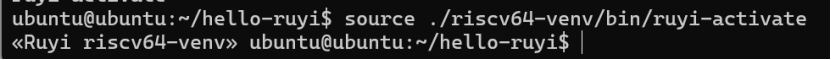

构建 ruyisdk-demo：
```bash
make
```
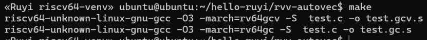

在完成虚拟环境的使用后，退出编译环境，一切都将被还原到进入以前的状态：
```bash
ruyi-deactivate
```
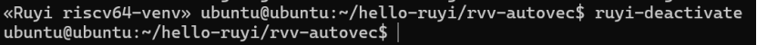

## 二．RuyiSDK IDE
方式：在 Windows+WSL 上运行 RuyiSDK IDE，在 QEMU RISC-V 客体实际执行 ruyi。

步骤：
（1）QEMU 启动时加 hostfwd=tcp::2222-:22 并在客体启用 openssh-server
（2）WSL 里安装 IDE 依赖（含 WebKitGTK）、将 IDE 解到 /opt/ruyisdk，把插件 zip 解到 dropins/
（3）在 WSL 生成 SSH 免密并写 \~/.ssh/config（别名如 riscv-qemu 指向 127.0.0.1:2222），创建 /usr/local/bin/ruyi 代理脚本把所有 ruyi 调用通过 SSH 转发到客体（--version 仅回一行）
（4）用 -clean 启动 IDE，在 Preferences → RuyiSDK → Ruyi Config 指定 /usr/local/bin/ruyi。

### 2.1 QEMU 侧准备
QEMU 启动命令包含 SSH 端口转发（把 2222 转发到客体 22）
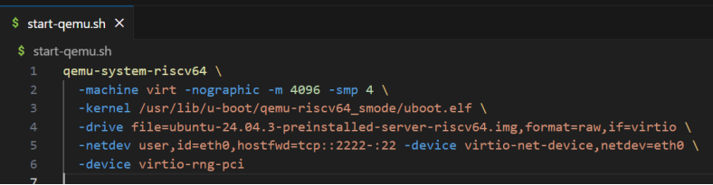

进入 RISC-V 客体后，开启 SSH 服务：
```bash
sudo apt update
sudo apt install -y openssh-server
sudo systemctl enable --now ssh
```
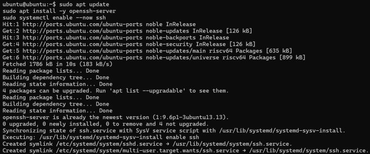

### 2.2 在 WSL 安装 RuyiSDK IDE（x86_64）与依赖
安装依赖：
```bash
sudo apt update
sudo apt install -y libwebkit2gtk-4.1-0 || sudo apt install -y libwebkit2gtk-4.0-37
sudo apt install -y libgtk-3-0 libcanberra-gtk3-module libnss3 libxss1 fonts-noto-cjk
```

下载并安装 IDE 到 /opt/ruyisdk：
```bash
mkdir -p ~/Downloads && cd ~/Downloads
VER=0.0.3
ARCH=$(uname -m)
PKG="ruyisdk-$VER-linux.gtk.$ARCH.tar.gz"
URL1="https://fast-mirror.isrc.ac.cn/ruyisdk/ide/$VER/$PKG"
URL2="https://mirror.iscas.ac.cn/ruyisdk/ide/$VER/$PKG"
wget -O "$PKG" "$URL1" || wget -O "$PKG" "$URL2"

# 解压到 /opt/ruyisdk
sudo mkdir -p /opt/ruyisdk
cd /opt/ruyisdk
sudo tar -zxvf ~/Downloads/$PKG
sudo chown -R "$USER:$USER" /opt/ruyisdk
```

### 2.3 安装 RuyiSDK IDE 插件（解压到 dropins）
下载插件：
```bash
wget -O ~/Downloads/org.ruyisdk.ide_0.0.6.zip \
"https://github.com/ruyisdk/ruyisdk-eclipse-plugins/releases/download/v0.0.6/org.ruyisdk.ide_0.0.6.zip"
```

解压到 dropins：
```bash
unzip -o ~/Downloads/org.ruyisdk.ide_0.0.6.zip -d /opt/ruyisdk/ruyisdk/dropins/
```

### 2.4 在 WSL 配置 ruyi 代理脚本（把 IDE 的 ruyi 调用转发到 RISC-V 客体）
配置免密 SSH 到客体：
```bash
test -f ~/.ssh/id_ed25519 || ssh-keygen -t ed25519 -N "" -f ~/.ssh/id_ed25519
ssh -p 2222 ubuntu@127.0.0.1 'mkdir -p ~/.ssh && chmod 700 ~/.ssh' || true
cat ~/.ssh/id_ed25519.pub | ssh -p 2222 ubuntu@127.0.0.1 'cat >> ~/.ssh/authorized_keys && chmod 600 ~/.ssh/authorized_keys'
```

写 SSH 别名（Host=riscv-qemu）：
```bash
mkdir -p ~/.ssh
cat > ~/.ssh/config <<'EOF'
Host riscv-qemu
  HostName 127.0.0.1
  Port 2222
  User ubuntu
  StrictHostKeyChecking no
  UserKnownHostsFile /dev/null
EOF
chmod 600 ~/.ssh/config
```

创建 /usr/local/bin/ruyi 代理脚本
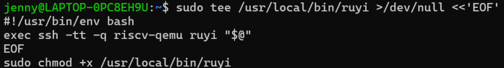

在 IDE 菜单中：Window → Preferences → RuyiSDK → Ruyi Config
在 Ruyi Installation Directory 位置处填写：/usr/local/bin
点击 Apply and Close

### 2.5 启动 RuyiSDK IDE（基于 Eclipse）
```bash
/opt/ruyisdk/ruyisdk/ruyisdk -clean -consoleLog
```
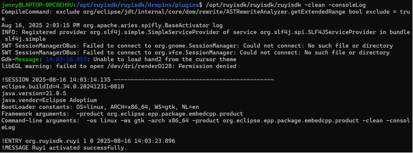
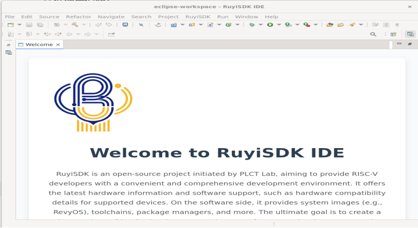