# 在 Milk-V Duo 上跑通 Alpine 与 RuyiSDK 的完整实践
## 一. 测试环境
### 测试环境与硬件清单
**系统版本环境信息**  
内核版本：5.10.4-tag-  
Alpine 发行版版本：3.19_alpha20230901  
架构：riscv64  
系统标识：Alpine Linux edge  

**硬件清单**  
Milk-V Duo 256M 开发板  
USB Type-C 数据线  
microSD 卡及读卡器  
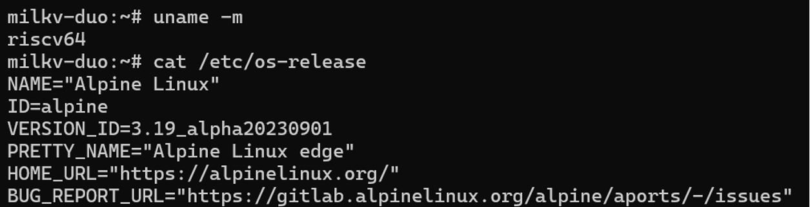

## 二. Alpine 系统安装
1. 下载与解压镜像
从 [Google Drive 链接](https://drive.google.com/file/d/1zhhB6AdgvjjuzBWjY6TchdX5b0uNWzP-/view) 下载 `milkv-duo-256m-alpinelinux-cwt-2023-10-28.img.zip`，在 Windows 中解压得到 `.img` 文件。  

2. 程序烧录
（1）安装并打开 balenaEtcher软件
（2）点击从文件烧录，选择刚解压的 .img镜像文件
（3）在选择目标磁盘处选择 microSD 卡
（4）点击现在烧录，完成后安全弹出 microSD卡

3. 更新 RNDIS 驱动程序
（1）连接设备
将 USB 数据线一端插入电脑，另一端连接到 Milk-V Duo 开发板。然后，打开电脑端的设备管理器。
（2）识别 RNDIS 设备
在 设备管理器 的“其他设备”栏目中，可以看到一个带有感叹号的 RNDIS 设备。
（3）更新驱动程序
右键点击该 RNDIS 设备，选择“更新驱动程序”。在弹出的窗口中，选择“浏览我的电脑以查找驱动程序”。继续选择“让我从计算机上的可用驱动程序列表中选取”。向下滚动列表，选择“网络适配器”。
（4）选择驱动型号
在“厂商”一栏选择“Microsoft”，在“型号”一栏选择“远程 NDIS 兼容设备”。
当系统弹出“更新驱动程序警告”提示时，点击“是”继续。

4. 使用SSH终端远程连接MILKV DUO256M开发板（使用PuTTY）
Host Name:192.168.42.1  
Port:22
login as:root
password:milkv
输入后可以远程进入操作系统
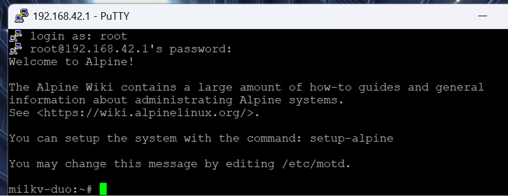

## 三. 设置共享网络
1. Windows 侧  
（1）用数据线连接板子，设备管理器出现 USB RNDIS 网卡。
（2）打开“网络连接”，更改适配器设置，进入Wi‑Fi→ 属性 → 共享，勾选“允许其他网络用户通过此计算机的 Internet 连接来连接”，家庭网络连接选择 RNDIS 适配器。
（3）给 RNDIS 设静态 IP：192.168.137.1

2. 板端（Alpine）侧  
（1）给设备 usb0 配置静态 IP：192.168.137.2
（2）删除旧的默认网关
（3）把Windows主机的共享网络地址 192.168.137.1 设置为默认网关
（4）配置 DNS 服务器
```bash
ifconfig usb0 192.168.137.2 netmask 255.255.255.0 up
route del default 2>/dev/null || true
route add default gw 192.168.137.1
cat > /etc/resolv.conf << 'EODNS'
nameserver 8.8.8.8
nameserver 1.1.1.1
nameserver 223.5.5.5
EODNS
```
（5）若 HTTPS 报证书错误且系统时间异常（1970 年），校准时间
```bash
busybox ntpd -q -n -p time.cloudflare.com || true
```
6）配置以上设置为开机自启
```bash
cat > /etc/usb-rndis.sh << 'EOS'
#!/bin/sh
ifconfig usb0 192.168.137.2 netmask 255.255.255.0 up
route del default 2>/dev/null
route add default gw 192.168.137.1
cat > /etc/resolv.conf << 'EODNS'
nameserver 8.8.8.8
nameserver 1.1.1.1
nameserver 223.5.5.5
EODNS
EOS
chmod +x /etc/usb-rndis.sh

cat > /etc/local.d/usb-rndis.start << 'EOS'
#!/bin/sh
/etc/usb-rndis.sh
EOS
chmod +x /etc/local.d/usb-rndis.start
rc-update add local default
```

## 四. RuyiSDK 安装
### 说明
官方发布的 ruyi-0.39.0.riscv64 预编译二进制无法直接运行，因为发布的二进制为 glibc 目标，而 Alpine 使用 musl，glibc 和musl 运行时不兼容。因此，采用python安装wheel包。

同时，开发板上网络环境不稳定，采用先在主机上安装依赖和wheel包，然后传到开发板上安装。

### 步骤
1. 安装运行时依赖
在 PowerShell 预下载 APK 依赖
```powershell
$dst = "$env:USERPROFILE\alpine-apks\riscv64"
New-Item -ItemType Directory -Force -Path $dst | Out-Null
Invoke-WebRequest -Uri https://dl-cdn.alpinelinux.org/alpine/v3.22/main/riscv64/py3-cparser-2.22-r1.apk -OutFile "$dst\py3-cparser-2.22-r1.apk"
Invoke-WebRequest -Uri https://dl-cdn.alpinelinux.org/alpine/v3.22/main/riscv64/py3-cffi-1.17.1-r1.apk -OutFile "$dst\py3-cffi-1.17.1-r1.apk"
Invoke-WebRequest -Uri https://dl-cdn.alpinelinux.org/alpine/v3.22/community/riscv64/llhttp-9.2.1-r0.apk -OutFile "$dst\llhttp-9.2.1-r0.apk"
Invoke-WebRequest -Uri https://dl-cdn.alpinelinux.org/alpine/v3.22/community/riscv64/libssh2-1.11.1-r0.apk -OutFile "$dst\libssh2-1.11.1-r0.apk"
Invoke-WebRequest -Uri https://dl-cdn.alpinelinux.org/alpine/v3.22/community/riscv64/libgit2-1.9.1-r0.apk -OutFile "$dst\libgit2-1.9.1-r0.apk"
Invoke-WebRequest -Uri https://dl-cdn.alpinelinux.org/alpine/v3.22/community/riscv64/py3-cached-property-1.5.2-r5.apk -OutFile "$dst\py3-cached-property-1.5.2-r5.apk"
Invoke-WebRequest -Uri https://dl-cdn.alpinelinux.org/alpine/v3.22/community/riscv64/py3-pygit2-1.18.2-r0.apk -OutFile "$dst\py3-pygit2-1.18.2-r0.apk"
```

PowerShell上传到开发板
```powershell
$IP="192.168.137.2"
ssh root@$IP "mkdir -p /boot/apks"
scp -O "$env:USERPROFILE\alpine-apks\riscv64\*.apk" root@$IP:/boot/apks/
```

开发板离线安装
```bash
apk add --allow-untrusted --no-network /boot/apks/py3-cparser-2.22-r1.apk /boot/apks/py3-cffi-1.17.1-r1.apk
apk add --allow-untrusted --no-network /boot/apks/llhttp-9.2.1-r0.apk
apk add --allow-untrusted --no-network /boot/apks/libssh2-1.11.1-r0.apk /boot/apks/libgit2-1.9.1-r0.apk
apk add --allow-untrusted --no-network /boot/apks/py3-cached-property-1.5.2-r5.apk /boot/apks/py3-pygit2-1.18.2-r0.apk
```

2. 部署ruyi
在wsl侧准备离线轮子
```bash
mkdir -p ~/ruyi-offline/pkgs && cd ~/ruyi-offline
python3 -m pip download -d pkgs --only-binary=:all: \
   ruyi==0.39.0 rich tomlkit semver jinja2 fastjsonschema pyyaml arpy argcomplete
```

把 ~/ruyi-offline/ 传到开发板
```powershell
$IP = "192.168.137.2"
ssh root@$IP "mkdir -p /boot/ruyi-offline/pkgs"
Get-ChildItem "\\wsl$\Ubuntu\home\jenny\ruyi-offline\pkgs" | ForEach-Object {
  scp -O $_.FullName "root@$IP:/boot/ruyi-offline/pkgs/"
}
```

开发板离线安装
```bash
mkdir -p /boot/ruyi-site
pip install --no-index --find-links /boot/ruyi-offline/pkgs --no-deps \
  --target /boot/ruyi-site \
  ruyi==0.39.0 rich tomlkit semver jinja2 fastjsonschema pyyaml arpy argcomplete \
  --break-system-packages
```

创建启动器
在 Alpine 上把离线安装的 RuyiSDK变成一个全局可用的命令 ruyi
```bash
cat > /usr/local/bin/ruyi << 'EOF'
#!/bin/sh
export RUYI_FORCE_ALLOW_ROOT=1
export CI=1
export PYTHONPATH=/boot/ruyi-site
exec python3 -m ruyi "$@"
EOF
chmod +x /usr/local/bin/ruyi
```

```bash
cat > /etc/profile.d/ruyi.sh << 'EOF'
export PYTHONPATH=/boot/ruyi-site
export RUYI_FORCE_ALLOW_ROOT=1
export CI=1
EOF
chmod +x /etc/profile.d/ruyi.sh
```

验证安装
```bash
ruyi version
```
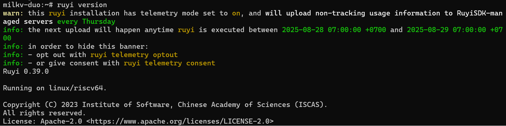

## 五. RuyiSDK 使用
1. 刷新本地软件包缓存
```bash
ruyi config set repo.remote https://mirror.iscas.ac.cn/git/ruyisdk/packages-index.git
ruyi update
```
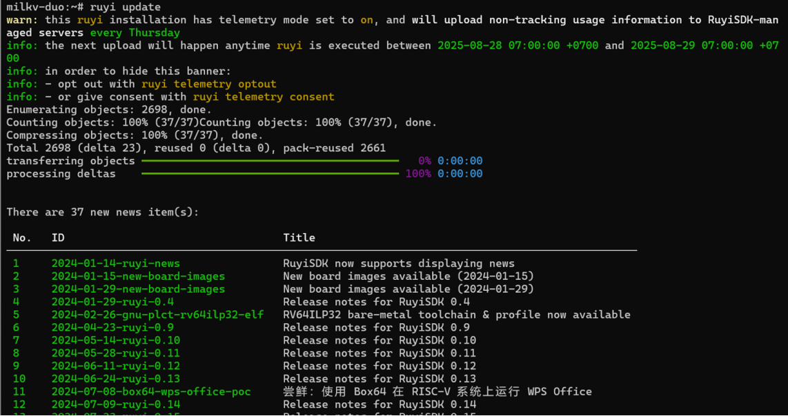

2. 阅读新闻
```bash
ruyi news list --new
```
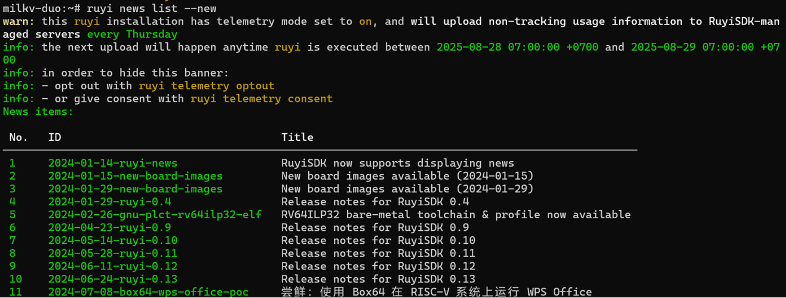

```bash
ruyi news read
```
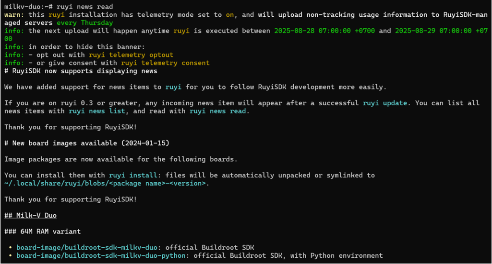

3. 列出软件包
```bash
ruyi list --name-contains ''
```
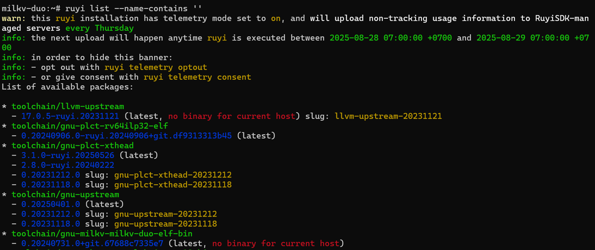

4. 使用二进制工具链构建并运行 CoreMark
在 WSL 下交叉编译（避免板端存储和算力不足）
工具链：`gnu-milkv-milkv-duo-musl-bin`
（1）在WSL下编译CoreMark
在wsl上安装RuyiSDK工具
```bash
wget https://mirror.iscas.ac.cn/ruyisdk/ruyi/tags/0.39.0/ruyi-0.39.0.amd64 -O ruyi
chmod +x ruyi
sudo mv ruyi /usr/local/bin/
ruyi version
```
创建虚拟环境并激活
```bash
ruyi install gnu-milkv-milkv-duo-musl-bin
ruyi venv -t gnu-milkv-milkv-duo-musl-bin generic milkv-venv
source ./milkv-venv/bin/ruyi-activate
```
获取源码并解包
```bash
mkdir coremark
cd coremark
ruyi extract coremark
```
指定交叉工具链（编辑构建脚本）
使用的工具链为 gnu-milkv-milkv-duo-musl-bin
```bash
sed -i 's/\bgcc\b/riscv64-unknown-linux-musl-gcc/g' linux64/core_portme.mak
```
构建CoreMark
```bash
make PORT_DIR=linux64 LFLAGS_END=-march=rv64gcv0p7xthead link
```
验证产物架构
```bash
file coremark.exe
```
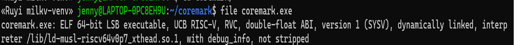
退出虚拟环境
```bash
ruyi-deactivate
```

（2）在 WSL 下从 WSL 拷贝到 Windows
```powershell
Copy-Item "\\wsl.localhost\Ubuntu-22.04\home\jenny\coremark\coremark.exe" "C:\Users\legion\coremark.exe" -Force
```

（3）通过 PowerShell 传输到 Milkv Duo 开发板
```powershell
$DuoIP = "192.168.137.2"
scp "C:\Users\legion\coremark.exe" "root@${DuoIP}:/root/"
```

（4）在 Milkv Duo 开发板上运行 CoreMark
```bash
cd /root
chmod +x coremark.exe
./coremark.exe
```
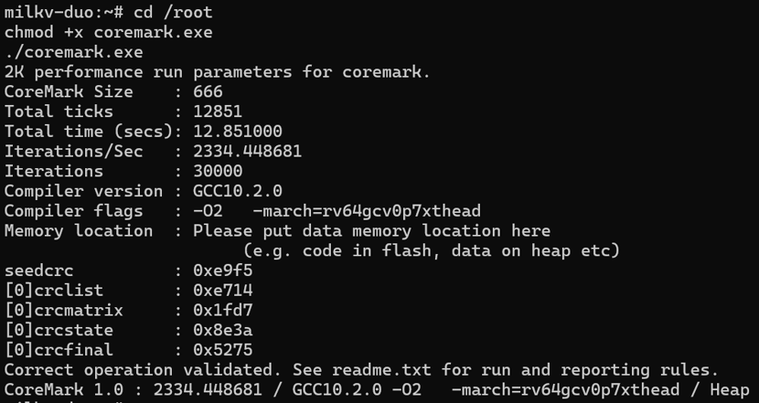

5. Milk-V Duo 交叉开发：从虚拟机环境配置到编译、上传、运行与远程调试
目标：在 VMware Ubuntu 22.04 虚拟机中，使用RuyiSDK + gnu-milkv-milkv-duo-musl 工具链 + RuyiSDK IDE，完成 Milk-V Duo 程序的编译 → 上传 → 运行 → gdbserver 远程调试的完整全链路。

网络环境说明：WSL2 默认使用 NAT 网络，Linux 子系统和宿主 Windows 不在同一网段，外部设备（如 Milk-V Duo）只能被 Windows 直接访问。在 WSL 内部没有路由能直连，所以执行ssh root@192.168.137.2会超时。因此，改用 VMware 桥接网络，使 Ubuntu 虚拟机与开发板处于同一局域网，从而实现稳定互通。

（1）VM 系统更新与常用工具
```bash
sudo apt update && sudo apt upgrade -y
sudo apt install -y build-essential git curl wget unzip zstd tar ssh
```

（2）安装 Ruyi
```bash
wget https://mirror.iscas.ac.cn/ruyisdk/ruyi/tags/0.39.0/ruyi-0.39.0.amd64 -O ruyi
chmod +x ruyi
sudo mv ruyi /usr/local/bin/
ruyi version
```

（3）创建并使用 Ruyi 虚拟环境
```bash
ruyi venv -t gnu-milkv-milkv-duo-musl-bin milkv-duo ~/venv-milkvduo
source ~/venv-milkvduo/bin/ruyi-activate
```

（4）安装并启动 RuyiSDK IDE（下载 `ruyisdk-0.0.3-linux.gtk.x86_64.tar.gz` 到 `~/Downloads`）
```bash
sudo tar -xvzf ~/Downloads/ruyisdk-0.0.3-linux.gtk.x86_64.tar.gz -C /opt/
cd /opt/ruyisdk && ./ruyisdk
```

（5）获取 hello-world 源码
```bash
ruyi extract milkv-duo-examples
```

（6）在 IDE 中导入 hello-world 工程并绑定工具链
导入 `hello-world` 工程
菜单路径：File → New → Project → C/C++ → Makefile Project with Existing Code → Next → 选源码目录 
→ Toolchain for Indexer Settings 选 RISC-V Cross GCC → Finish
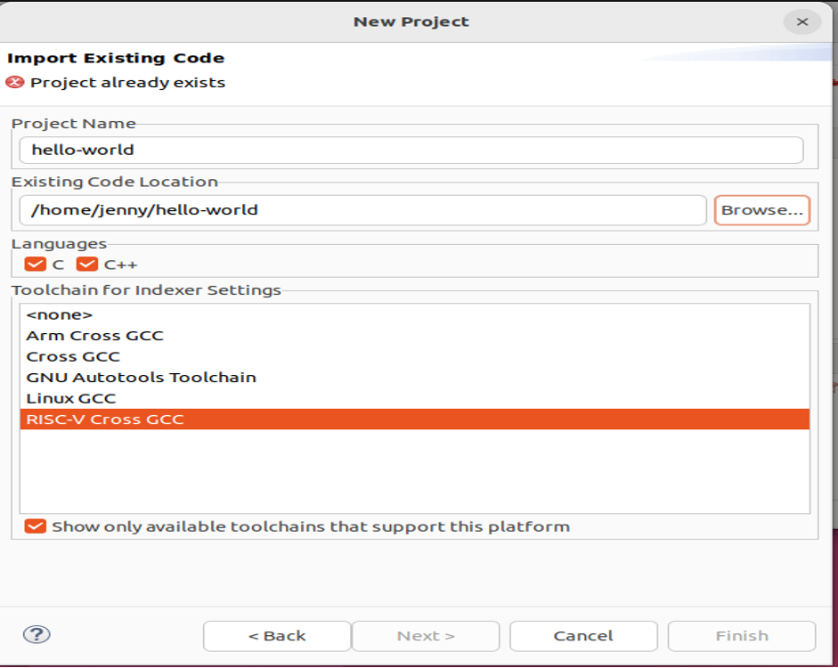

设置工具链路径：Properties → RISC-V Toolchains Paths → Toolchain folder →选择工具链的 bin/ 目录
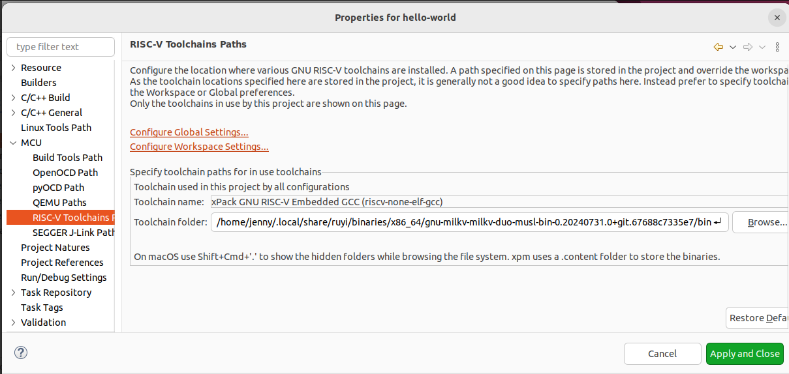

设置工具链路径：Properties → C/C++ Build → Settings → Prefix:riscv64-unknown-linux-musl-
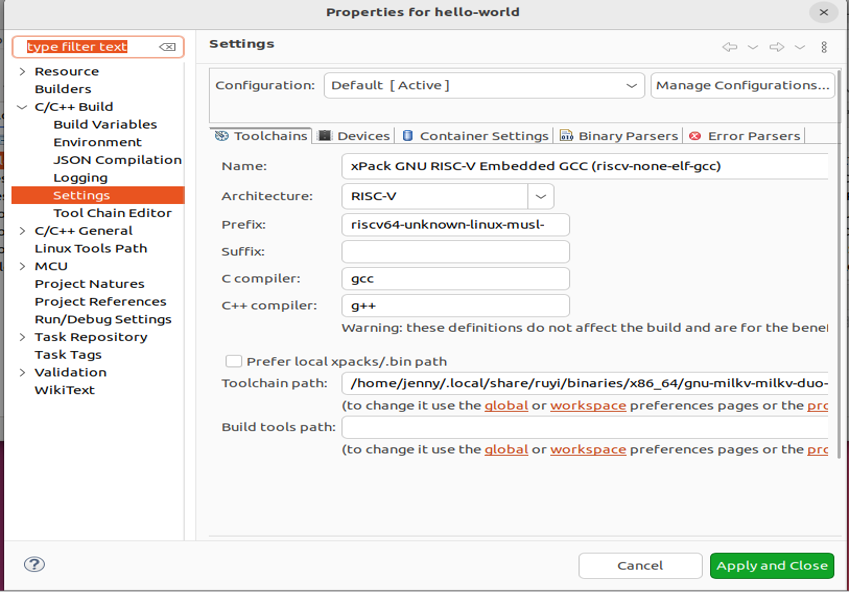

准备Makefile
```
# ================= 基本信息 =================
TARGET := helloworld
# 工具链前缀
TOOLCHAIN_PREFIX := /home/jenny/.local/share/ruyi/binaries/x86_64/gnu-milkv-milkv-duo-musl-bin-0.20240731.0+git.67688c7335e7/bin/riscv64-unknown-linux-musl-
# 设备信息
DUO_IP   := 192.168.137.2
DUO_USER := root
DUO_DIR  := /root/target
# ================= 编译参数 =================
CFLAGS  := -mcpu=c906fdv -march=rv64imafdcv0p7xthead -mabi=lp64d -mcmodel=medany -g
LDFLAGS :=
# ================= 派生变量 =================
CC    := $(TOOLCHAIN_PREFIX)gcc
SRC   := $(wildcard *.c)
OBJS  := $(patsubst %.c,%.o,$(SRC))
DUO_BIN := $(DUO_DIR)/$(TARGET)
# ================= 规则 =================
.PHONY: all clean upload deploy run-remote mkduodir
all: $(TARGET)
$(TARGET): $(OBJS)
 $(CC) $(CFLAGS) -o $@ $(OBJS) $(LDFLAGS)
%.o: %.c
 $(CC) $(CFLAGS) -c $< -o $@
clean:
 rm -f $(TARGET) $(OBJS)
mkduodir:
 ssh $(DUO_USER)@$(DUO_IP) "mkdir -p $(DUO_DIR)"
upload: $(TARGET) mkduodir
 scp $(TARGET) $(DUO_USER)@$(DUO_IP):$(DUO_BIN)
run-remote: upload
 ssh $(DUO_USER)@$(DUO_IP) "$(DUO_BIN)"
deploy: all upload
```

构建、上传与运行
```bash
# 在工程目录
make            # 仅编译
make upload     # 上传到 /root/target
make run-remote # 在板端直接运行
```
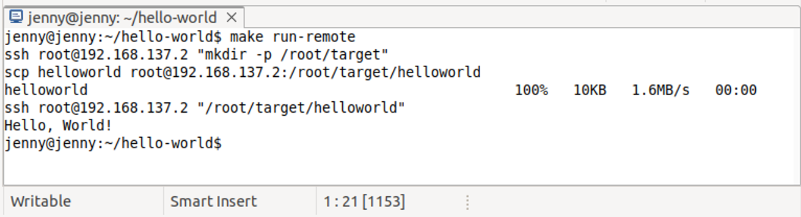

终端方式远程调试
在开发板安装gdbserver
在windows主机下载gdbserver可执行程序：https://github.com/milkv-duo/duo-buildroot-sdk/blob/develop/ramdisk/rootfs/public/gdbserver/riscv_musl/usr/bin/gdbserver
用 PowerShell 直接传到 Duo开发板
```bash
scp C:\Users\legion\Downloads\gdbserver root@192.168.137.2:/usr/bin/
ssh root@192.168.137.2 "chmod +x /usr/bin/gdbserver && which gdbserver"
```
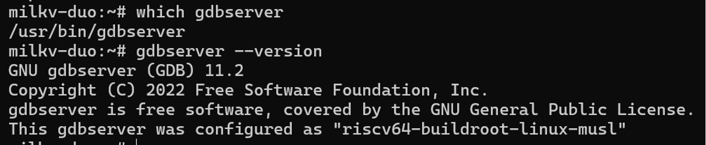

开发板端
```bash
ssh root@192.168.137.2
cd /root/target
gdbserver :2345 ./sumdemo
```
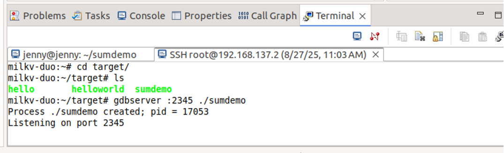

主机（VMWare Ubuntu22.04）端
```bash
source ~/venv-milkvduo/bin/ruyi-activate
cd ~/sumdemo   
riscv64-unknown-linux-musl-gdb ./sumdemo
(gdb) target remote 192.168.137.2:2345
(gdb) break sumdemo.c:6
(gdb) c
(gdb) p result
(gdb) bt
```
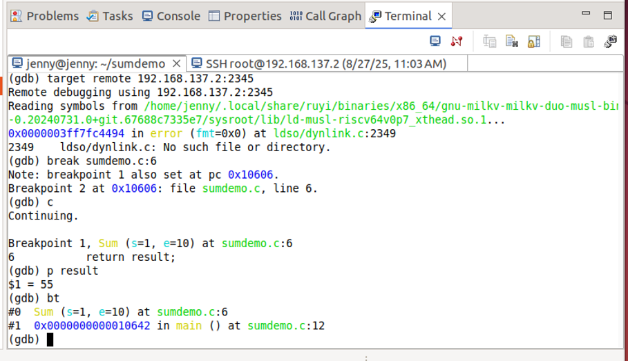


## 六. 补充说明
（1）网络配置（USB RNDIS 网卡持久化）
Ubuntu 22.04 默认使用 Netplan 管理网络。Duo 的 USB 网卡每次插拔时设备名可能不同（如 `enxca6a37d83153`、`enx1e977ef562f9` 等），因此需要进行灵活配置，保证虚拟机既能上网又能与开发板通信。

/etc/netplan/99-duo.yaml 示例：
```yaml
network:
  version: 2
  renderer: networkd
  ethernets:
    # 外部网络接口（走 DHCP 上网）
    ens33:
      dhcp4: true
      optional: true
    # Duo 的 USB RNDIS 网卡（静态 IP）
    enxca6a37d83153:
      dhcp4: no
      addresses:
        - 192.168.137.100/24
```
`ens33`：配置为 `dhcp4: true`，开机时自动获取外部网络 IP，保证 Ubuntu 能正常上网。
`enxca6a37d83153`：配置为固定 IP `192.168.137.100/24`，与 Duo 的 `192.168.137.2` 同网段，用于和开发板互联。

自动化修复脚本：
为避免每次 USB 网卡名变化导致配置失效，编写脚本 `/usr/local/bin/fix-duo-net.sh` 自动检测并更新 Netplan。
```bash
#!/bin/bash
CONFIG_FILE="/etc/netplan/99-duo.yaml"
STATIC_IP="192.168.137.100/24"
DUO_IFACE=$(ip -o link show | awk -F': ' '{print $2}' | grep ^enx | head -n1)

cat <<EOF | tee $CONFIG_FILE
network:
  version: 2
  renderer: networkd
  ethernets:
    ens33:
      dhcp4: true
      optional: true
    $DUO_IFACE:
      dhcp4: no
      addresses:
        - $STATIC_IP
EOF

chmod 644 $CONFIG_FILE
netplan apply
ip link set $DUO_IFACE up
```

systemd 服务实现开机自动修复
文件路径：`/etc/systemd/system/fix-duo-net.service`
```ini
[Unit]
Description=Auto configure Milkv Duo USB RNDIS interface
After=network-pre.target
Wants=network-pre.target

[Service]
Type=oneshot
ExecStart=/usr/local/bin/fix-duo-net.sh
RemainAfterExit=yes

[Install]
WantedBy=multi-user.target
```

启用：
```bash
sudo systemctl daemon-reload
sudo systemctl enable fix-duo-net.service
```

（2）SSH 免密配置
```bash
ssh-keygen -t rsa -b 4096 -f ~/.ssh/milkvduo -N ""
cat ~/.ssh/milkvduo.pub | ssh root@192.168.137.2 'mkdir -p ~/.ssh && cat >> ~/.ssh/authorized_keys'
```
这样 `make upload`、`make run-remote` 就不需要每次输入密码。

